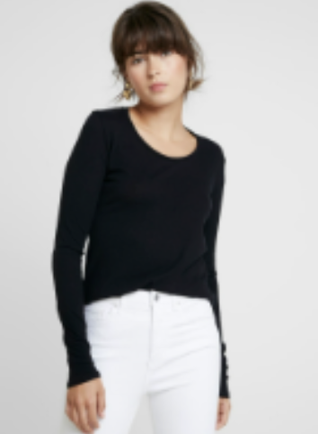
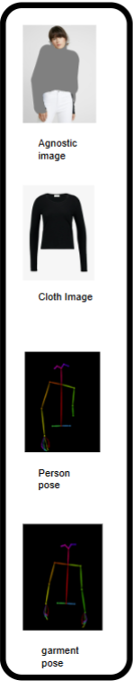
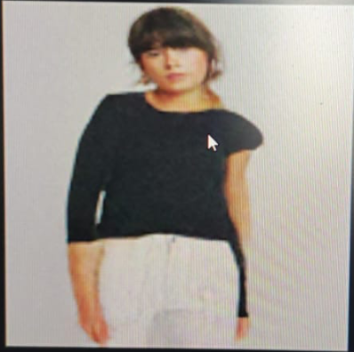

# TryOnDiffusion: An Implementation and Exploration

This repository contains a PyTorch implementation of the research paper **["TryOnDiffusion: A Tale of Two UNets"](https://arxiv.org/abs/2306.08276)**. This project chronicles a three-month journey from foundational concepts in generative modeling to the hands-on implementation and training of a virtual try-on pipeline.

After extensive research and development, the base model was trained on a limited dataset. The results, detailed below, validate the paper's two-stage architectural design and highlight the critical role of the super-resolution model for achieving photorealism.

## Trained Model Weights

A checkpoint for the trained **Base Model (128x128)** is available on the Hugging Face Hub. This model can be used as the foundation for training the Super-Resolution model.

[](https://huggingface.co/Aditya757864/TRY_ON)

---

## Tech Stack


---

## What's new: production data/training pipeline

The codebase was reworked for higher-resolution, production-style training:

- **Resolution increased**: base U-Net `128→256`, SR U-Net `256→512` (`config.py`).
- **Only two images required as input** — a person photo and a garment photo. The
  clothing-agnostic image and pose keypoints the architecture needs are now
  **derived automatically** (`tryondiffusion/preprocessing.py`) instead of having
  to be hand-prepared per sample.
- **Data comes from the Hugging Face Hub by default** — no more manually
  downloading VITON-HD and hand-building a CSV mapping
  (`tryondiffusion/hf_dataset.py`). A local-folder path is still available for
  custom/private datasets.
- **One unified, config-driven trainer** (`trainer.py`) replaces the old
  `trainer.py` / `trainer01.py` / `trainer02.py` split, with defaults tuned for
  NVIDIA Hopper/Blackwell (incl. **B200**) GPUs.
- **One production inference pipeline** (`tryon_pipeline.py`), used by both the
  CLI and the Gradio demo (`app.py`).

> **Checkpoint compatibility**: the `checkpoint.11800` / `checkpoint.11900`
> weights in this repo (and on the [Hugging Face model page](https://huggingface.co/Aditya757864/TRY_ON))
> were trained at the old `128x128` resolution. They are **not** compatible with
> the new `256x256` default (image resolution changes the Parallel-UNet's
> internal patchify layer shapes). Either pass `--base-image-size 128 128` to
> keep training/serving that checkpoint, or start fresh at the new default
> resolution for higher fidelity.

### Setup

```bash
pip install -r requirements.txt
```

On a headless/minimal server or container (common for cloud GPU boxes), also
install MediaPipe's native GL dependencies — needed for the on-the-fly pose
estimation in `tryondiffusion/preprocessing.py`, even for CPU-only pose
inference:
```bash
sudo apt-get update && sudo apt-get install -y libegl1 libgl1 libgbm1
```
Without these you'll hit `OSError: libEGL.so.1: cannot open shared object file`
the first time pose estimation actually runs (training or inference on data
that doesn't already have precomputed pose annotations).

### Data: Hugging Face Hub (default) or local folder

By default every script pulls from
[`SaffalPoosh/VITON-HD-test`](https://huggingface.co/datasets/SaffalPoosh/VITON-HD-test)
(the standard VITON-HD benchmark set repackaged with `image`/`cloth`/`openpose_json`
columns — 2,032 samples). Point `--hf-dataset-id` at any other Hub dataset that has
at least a person-image column and a garment-image column — e.g. a larger private
dataset for real production training — and pass matching
`--hf-person-image-column` / `--hf-cloth-image-column` if the column names differ.
If the dataset also ships pose annotations or a precomputed agnostic image,
point `--hf-pose-column` / `--hf-agnostic-image-column` at them to skip
auto-derivation (faster, and generally more accurate than the built-in heuristic).

To train from local files instead, pass `--data-source local --local-root <dir>`
with `<dir>/person_images/`, `<dir>/garment_images/`, and a `tryon_mapping.csv`
(generate it with `csv_mapping.py`).

### Training on NVIDIA B200 / Blackwell

`trainer.py` enables TF32 matmuls and defaults to **bf16** mixed precision
(`--mixed-precision bf16`), which is the recommended numeric format on
Hopper/Blackwell tensor cores (no loss-scaling needed, unlike fp16). Attention
throughout the model already uses PyTorch's native
`scaled_dot_product_attention`, which automatically selects flash-attention
kernels on B200 — no extra dependency (e.g. `xformers`) required.

Single GPU:
```bash
python trainer.py --unet-number 1 --batch-size 64
```

Multi-GPU / multi-node (B200 nodes typically have 8 GPUs with NVLink/NVSwitch):
```bash
accelerate config   # choose multi-GPU / DeepSpeed as appropriate for your node
accelerate launch trainer.py --unet-number 1 --batch-size 64
```

Recommendations for large B200 nodes:
- Use `--gradient-accumulation-steps` to grow the *effective* batch size instead
  of the per-GPU batch size once you're near VRAM limits.
- Set `NCCL_P2P_LEVEL=NVL` (or leave unset to let NCCL auto-detect NVLink) for
  fast multi-GPU all-reduce on NVLink-connected nodes.
- Use a CUDA 12.8+ build of PyTorch (Blackwell/`sm_100` support requires it).
- `torch.compile` (`compile_model`, on by default, mode `default`) JIT-compiles
  each U-Net's `forward` for extra throughput; `trainer.py` also disables
  inductor's CUDA-graphs capture by default (see known issue below) — disable
  compilation entirely with `--no-compile-model` if you hit further issues
  while iterating on architecture changes.

#### Known issue: MIG-partitioned B200s and a cryptic `NVML_SUCCESS == r` crash

If you're training on a **MIG slice** of a B200 (check with `nvidia-smi` —
look for `MIG M. Enabled` and a `MIG devices` table) rather than a full GPU,
you may hit this on the very first training step, regardless of batch size:

```
RuntimeError: NVML_SUCCESS == r INTERNAL ASSERT FAILED at
".../CUDACachingAllocator.cpp":1165, please report a bug to PyTorch.
```

This is **not** a bug in this repo, and usually not a real out-of-memory
condition either — it's a known PyTorch/NVML compatibility gap on MIG
instances: PyTorch's CUDA caching allocator queries GPU memory info via
NVML, and `nvmlDeviceGetMemoryInfo` doesn't behave the same way on a MIG
device as on a full GPU across various driver/PyTorch version combinations,
so the query itself fails instead of the allocator working (or reporting a
clean OOM) normally.

Workarounds, in order of how likely they are to help:
1. Switch PyTorch off its default caching allocator for the affected NVML
   code path:
   ```bash
   PYTORCH_NVML_BASED_CUDA_CHECK=0 PYTORCH_CUDA_ALLOC_CONF=backend:cudaMallocAsync \
   python3 trainer.py --unet-number 1 ...
   ```
2. `--no-compile-model` (rules out any interaction with `torch.compile`'s
   memory patterns as a contributing factor).
3. If neither helps, this needs a full (non-MIG) GPU allocation — ask
   whoever provisioned the instance for an un-partitioned B200. NVML works
   normally on a full GPU; this class of issue is specific to MIG.

### Running each file

| File | What it does | Typical use |
|---|---|---|
| `config.py` | Central `TryOnConfig` dataclass (resolution, data source, hardware/precision, checkpointing). Every other script builds its config from here — edit defaults here rather than in multiple scripts. | Imported, not run directly. |
| `tryondiffusion/preprocessing.py` | Auto-derives the clothing-agnostic image (pose-based or, optionally, a real segmentation model) and pose keypoints (MediaPipe, or parsed from a dataset's OpenPose JSON) whenever only a person+garment image are available. | Imported by both dataset classes and `tryon_pipeline.py`. |
| `tryondiffusion/hf_dataset.py` | `HFTryOnDataset` / `HFTryOnIterableDataset` — loads a virtual try-on dataset directly from the Hugging Face Hub (map-style or streaming). | Imported by `trainer.py` when `--data-source huggingface` (default). |
| `RealTryonDataset.py` | Local-folder dataset (person + garment images, with optional precomputed agnostic image / pose). | Imported by `trainer.py` when `--data-source local`. |
| `csv_mapping.py` | Scans a local data folder's subfolders and writes `tryon_mapping.csv` for `RealTryonDataset`. | `python csv_mapping.py` (edit `root_dir` at the bottom, or import `generate_structured_csv`). |
| `trainer.py` | Unified training entrypoint for both the base and SR U-Nets. See `--help` for every flag (mirrors `TryOnConfig`). | `python trainer.py --unet-number 1` (base) or `--unet-number 2 --init-checkpoint-path <base ckpt>` (SR), optionally under `accelerate launch`. |
| `tryon_pipeline.py` | Production inference: loads a trained checkpoint once, exposes `TryOnPipeline.generate(person_image, garment_image)`. | `python tryon_pipeline.py --checkpoint <ckpt> --person p.jpg --garment g.jpg --output out.png`, or import `TryOnPipeline` in serving code. |
| `app.py` | Gradio web demo built on `TryOnPipeline`. | `python app.py`, then open the local URL. Set `TRYON_CHECKPOINT=<path>` to point at a specific checkpoint. |
| `tryondiffusion/tryondiffusion.py` | Library code: the Parallel-UNet architecture (`ParallelUNet`, `BaseParallelUnet`, `SRParallelUnet`) and the cascaded-diffusion `TryOnImagen` model (training losses, sampling loop, classifier-free guidance). | Imported, not run directly. |
| `tryondiffusion/tryon_imagen_trainer.py` | Library code: `TryOnImagenTrainer` — wraps `TryOnImagen` with `accelerate` (mixed precision, gradient accumulation, multi-GPU), EMA, and checkpointing. | Imported, not run directly. |
| `examples/test_parallel_unet.py`, `test_parallel_unet_gpu.py` | Micro-benchmarks: instantiate a single U-Net, run one forward pass on random tensors, and profile it (CPU / GPU variants). | `python examples/test_parallel_unet.py` — sanity-check a U-Net's shapes/speed in isolation, e.g. after an architecture change. |
| `test_tryon_imagen.py` | Smoke test of the full 2-unet `TryOnImagen` cascade (forward pass, backward pass, sampling) on random tensors — no dataset needed. | `python test_tryon_imagen.py` — quick check that the model wiring itself is intact. |
| `test_tryon_imagen_trainer.py` | Smoke test of `TryOnImagenTrainer` (train/valid steps + sampling) against `RealTryonDataset` pointed at `./data`. | `python test_tryon_imagen_trainer.py` — quick check that dataset + trainer + model integrate correctly, before a real run. |

---

## Model Architecture: A Tale of Two UNets

The core of TryOnDiffusion lies in its two-stage cascaded diffusion process, which is essential for generating high-resolution, detailed images.

#### 1. The Base U-Net (Generator)
*   **Purpose:** To generate a low-resolution (`128x128`) image that captures the core essence of the try-on.
*   **Function:** This U-Net takes the noised target image and is heavily conditioned on the person's pose, the clothing-agnostic person representation, and the garment's features. Its primary responsibility is to get the **structure, color, and garment placement correct**. It learns the overall composition of the final image.

#### 2. The Super-Resolution U-Net (Refiner)
*   **Purpose:** To upscale the low-resolution image to a higher resolution (`256x256` or more) and add high-fidelity details.
*   **Function:** This U-Net takes the output from the Base U-Net, slightly noises it, and learns to denoise it back to a clean, high-resolution image. It is also conditioned on the pose and garment features, but its main job is to **refine textures, sharpen edges, and generate realistic details** that are impossible to capture at a lower resolution.

---

> The rest of this document (below) is the original project write-up and
> reflects the first training run at the old `128x128`/`256x256` resolution on
> a ~500-image subset. It's kept as a historical record of what was learned;
> see "What's new" above for the current, higher-resolution production setup.

## Project Journey & Key Learnings

This project was the culmination of over three months of dedicated research and development, progressing from foundational skills to advanced implementation.

### Phase 1: Research & Foundation
*   **Core Skills:** Built a strong foundation in Computer Vision, mastered PyTorch, and gained practical experience with generative models by implementing GANs (POKEGAN) and foundational Diffusion Models (DDPM).
*   **Advanced Concepts:** Studied Transformers, Attention mechanisms, and modulation techniques like FiLM to understand the state-of-the-art in generative AI.
*   **Paper Selection:** After extensive review, the "TryOnDiffusion" paper was chosen for its innovative two-stage architecture.

### Phase 2: Implementation & Training
*   **Codebase Development:** The project began from an open-source implementation by **fashnAI**, which was then heavily modified. This involved creating a custom data mapper and `DataLoader` for the HR-VITON dataset and writing a new, robust trainer script with fault-tolerant checkpointing.
*   **Training Process:** The **Base Model** was trained on a small subset (~500 images) of the HR-VITON dataset using an **NVIDIA RTX 4090 (24GB)**. All experiments were meticulously tracked using **Weights & Biases (`wandb`)**.

---

## Phase 3: Results, Insights & The Path Forward

Of course. Presenting data effectively is crucial. Let's transform that section into something much more professional, visually appealing, and updated with your new step count.

The key to making it visually appealing in Markdown is to use a **table** to place the graphs side-by-side for direct comparison, and to use formatting like **blockquotes** and **bullet points** to structure the analysis clearly.

---

### Quantitative Analysis: Learning Dynamics

The training and validation metrics, tracked over **11,900 steps**, clearly illustrate the model's learning journey and the classic signs of overfitting on a limited dataset. This analysis confirms that the model is learning correctly and provides a clear direction for the next phase.

| Training Loss | Validation Loss |
| :----------------------------------------------------------: | :-----------------------------------------------------------: |
|  |  |
| <ul><li>Shows a steep, rapid decrease, converging successfully within the first ~2,000 steps.</li><li>This confirms the model has sufficient capacity to learn and effectively **memorize** the training data.</li></ul> | <ul><li>The key indicator of generalization. The loss decreases to its lowest point around step 1,100.</li><li>After this point, the loss begins to consistently rise, forming a classic 'U' shape. This is a definitive sign of **overfitting**.</li></ul> |

> ### **Conclusion: Successful Learning & Predictable Overfitting**
>
> This is the expected and ideal outcome for this stage of the project. It demonstrates that the model is powerful enough to learn the task. The overfitting indicates that the next critical step is to **scale up the dataset** and begin training the **Super-Resolution model**, which will improve generalization and add photorealistic detail.
### Qualitative Analysis (Image Outputs)

The generated images from the overfit base model align perfectly with the story told by the loss curves.

| | | | | |
|:---:|:---:|:---:|:---:|:---:|
|  |  |  |  |

These outputs demonstrate that the base model successfully learns:
*   **Correct pose and body shape.**
*   **Accurate garment placement and color transfer.**
*   **The overall composition of the scene.**

However, as a direct result of overfitting on a small dataset, the images lack high-frequency details, sharpness, and realistic texture.
### Visual Analysis

*Sample model output after 2000 epochs.*
| Original Input | Input Features | Generated Output | 
 | ----- | ----- | ----- | 
|  |  |  | 

> ### **Key Insight: The Necessity of the Super-Resolution Model**
>
> These results are not a failure but a critical validation of the paper's two-stage design. The base model's job is to create a structurally correct "blueprint." Our experiments confirm it does this well, but it cannot create photorealistic details on its own, especially when data is limited.
>
> **Achieving photorealism is the explicit role of the Super-Resolution (SR) UNet.** The next and most important step is to leverage this well-structured base model output to train the SR model on a larger dataset, which will be responsible for painting in the final details and textures.

### Future Work
1.  **Train the SR Model:** Utilize the trained base model checkpoint as the foundation for training the second-stage Super-Resolution UNet.
2.  **Scale the Dataset to Combat Overfitting:** Expand the training data to the full HR-VITON dataset to provide the model with enough variety to generalize effectively and prevent the validation loss from increasing.
3.  **Hyperparameter Tuning:** Systematically tune the learning rate and batch size for the more memory-intensive SR training phase.
4.  **Explore Advanced Loss Functions:** Investigate perceptual losses like LPIPS to supplement the L1/L2 loss, which may guide the SR model to produce more visually pleasing textures.
